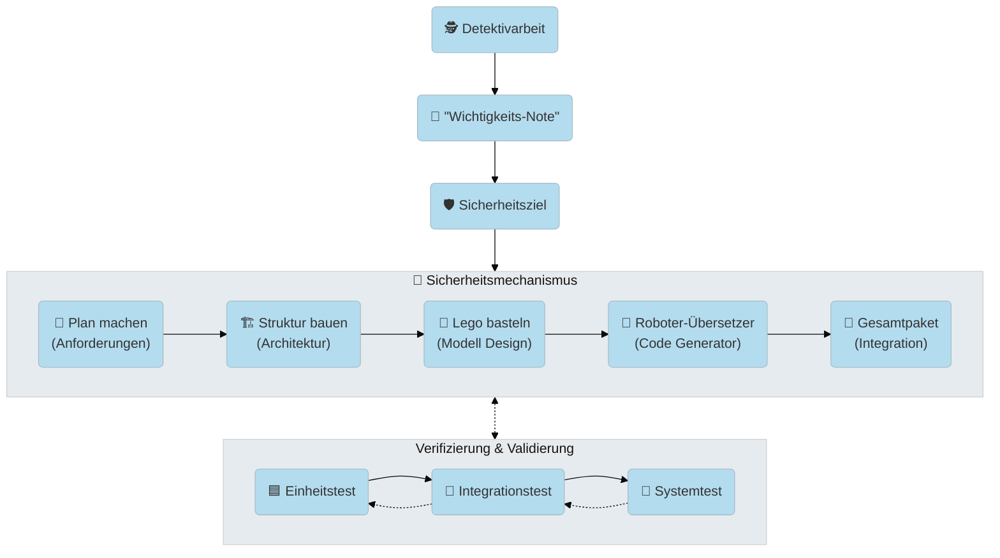
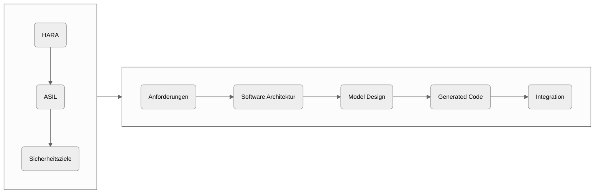

```mermaid
%%{init: { 'theme': 'base', 'themeVariables': { 'primaryColor': '#b4dcef', 'edgeLabelBackground':'#ffffff', 'tertiaryColor': '#e6ebef'} } }%%
flowchart TB
    A1("🕵️ Detektivarbeit")        
    A2("🔴 &quot;Wichtigkeits-Note&quot;")
    A3("🛡️ Sicherheitsziel")
    A1 --> A2
    A2 --> A3

    %% Der Bau-Teil (Die Umsetzung)
    subgraph Bau ["🎯 Sicherheitsmechanismus"]
        direction LR
        B1("📝 Plan machen<br>(Anforderungen)")
        B2("🏗️ Struktur bauen<br>(Architektur)")
        B3("🧱 Lego basteln<br>(Modell Design)")
        B4("🤖 Roboter-Übersetzer<br>(Code Generator)")
        B5("🎁 Gesamtpaket<br>(Integration)")
            
        B1 --> B2
        B2 --> B3
        B3 --> B4
        B4 --> B5
    end

    %% Verbindung von der Sicherheit zum Test
    A3 --> Bau

    %% Der Test-Teil (Die Umsetzung)
    subgraph Test ["Verifizierung & Validierung"]
        direction LR
        C1("🟦 Einheitstest")
        C2("🧩 Integrationstest")
        C3("🚗 Systemtest")

        C1 --> C2
        C2 -.-> C1
        C2 --> C3
        C3 -.-> C2
    end        

    %% Verbindung vom Bau zum Test
    Bau <-.-> Test
```

```mermaid
%%{init: { 'theme': 'neutral', 'themeVariables': {'fontFamily': 'Helvetica', 'fontSize': '12px'} } }%%
flowchart LR;
    subgraph A [ ]
        direction LR
        A1(Anforderungen)
        A2(Software Architektur)
        A3(Model Design)
        A4(Generated Code)
        A5(Integration)
        A1 --> A2
        A2 --> A3
        A3 --> A4
        A4 --> A5
    end

    subgraph B [ ]
        direction TD
        B1(HARA)
        B2(ASIL)
        B3(Sicherheitsziele)
        B1 --> B2
        B2 --> B3
    end

    B --> A
```